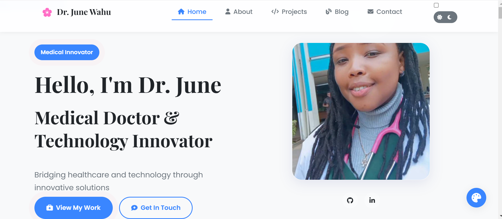

# 🩺 June Wahu: Healthcare Innovation Portfolio 🌐  
*A Healing Touch of Code & Medical Technology*  

  
*(Behold! The masterpiece in daylight mode ✨)*  

---

## 🚀 **Why This Portfolio?**  
This isn't just another portfolio; it's a **bridge between medicine and technology**! Designed for:  
- 🤝 **Potential collaborators** needing proof of skills  
- 🎯 **Hiring managers** seeking multidisciplinary talent  
- 🏆 **Software engineers** who love clean code + wow factor  

---

## ✨ **Key Features That Pop**  

| Feature          | Cool Factor | What It Does |  
|------------------|-------------|--------------|  
| 🌗 **Dark/Light Mode** | ⭐⭐⭐⭐⭐ | Saves retinas at 2AM coding sessions |  
| 🎨 **Custom Color Themes** | ⭐⭐⭐⭐ | Match your mood (or brand colors)! |  
| ✨ **Particle.js Background** | ⭐⭐⭐⭐ | Hypnotic floating dots = instant "whoa" |  
| 📚✍️  **Tech Blog** | ⭐⭐⭐⭐ | I write about: AI in radiology 🖥️  Telemedicine architecture 📡 Ethical healthcare tech ⚖️ |  
| 📊 📂  **Projects Gallery** | ⭐⭐⭐⭐⭐ | 6+ real-world projects including: AI Diagnosis Tools 🤖  Blockchain Health Records ⛓️  Medical Data Dashboards 📊   |  
| 📝 **Interactive CV** | ⭐⭐⭐ | PDF download + key highlights |  
| 📝 **Pitch Deck Presentations** | ⭐⭐⭐⭐⭐ | With every slide, I aim to show you how my innovations don’t just disrupt healthcare, they improve lives. | 

---

## 🛠 **Tech Stack** *(No Black Magic Here)*  

**Frontend:**  
- 📜 **HTML5** – Semantic, accessible, validator-approved  
- 🎨 **CSS3** – Flexbox/Grid, animations, dark/light themes  
- ⚡ **JavaScript** – Dynamic theming, DOM magic  

**Special Effects:**  
- ✨ **Particle.js** – Those floaty background dots  
- 📈 **Chart.js** – Skills visualization (optional)  

---


## 🏃‍♂️ **Let's Get This Running!**  

### Option 1: Quick Peek 👀  
Just open `index.html` in your favorite browser!  

### Option 2: Clone & Explore (For Devs)  
```bash
git clone https://github.com/Junewahu/JuneWahu-portfolio.git
cd JuneWahu-portfolio
```
Pro Tip: Use Live Server in VS Code for best experience!

## OR:
🌐 Open the live GitHub Pages URL

https://junewahu.github.io/JuneWahu-portfolio-website/


## 🎉 Special Thanks To: 

The amazing free fonts from Google Fonts

Coffee ☕ (The real MVP)

You for checking this out! 🙌


"Coding is like medicine - it's all about solving problems with precision!" 💻❤️

Made with ❤️, ☕, and late-night coding sessions.

© 2025 June Wahu - Healing the world, one line of code at a time.